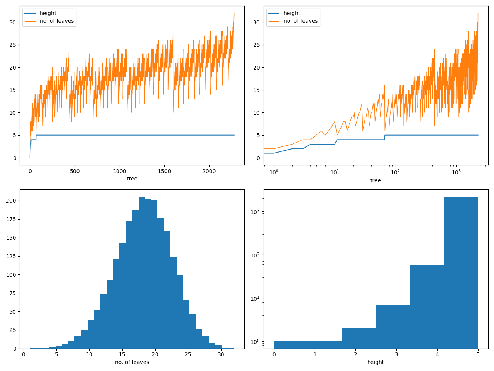

# ancestree

The question "Can we uniquely number every binary merger ancestry?" is equivalent to the question "Can we uniquely number every full binary tree?" which, in turn, is equivalent to the question "Is there a bijective mapping between the set $\\{(m,n)|m,n\in\mathbb{N}_0;m\ge n\\}$ and the set $\mathbb{N}_1$?" It turns out the answer is Yes, so now the question is How, especially, how to do it succinctly.

In my proposed method, merging two objects with ancestries numbered $m$ and $n$ (where $m\ge n$) results in a remnant object with an ancestry numbered $\frac{m(m+1)}{2}+n+1$, with a natal object being numbered $0$, denoting the simplest possible ancestry. Every ordered pair of numbers $(m,n)$ merges to a unique number $p$, and every number $p$ can be split into a unique ordered pair of numbers $(m,n)$, i.e., this is a one-to-one mapping. In this system, a higher number roughly implies a more complicated ancestry.

For example: $\frac{3(3+1)}{2}+2+1=9$
```
                       ┌───┴───┐   
 ┌─┴─┐  +  ┌─┴─┐  =  ┌─┴─┐   ┌─┴─┐ 
┌┴┐ ┌┴┐   ┌┴┐       ┌┴┐ ┌┴┐ ┌┴┐    
   3         2             9
```
## Statistics
<p float="left">
  
</p>